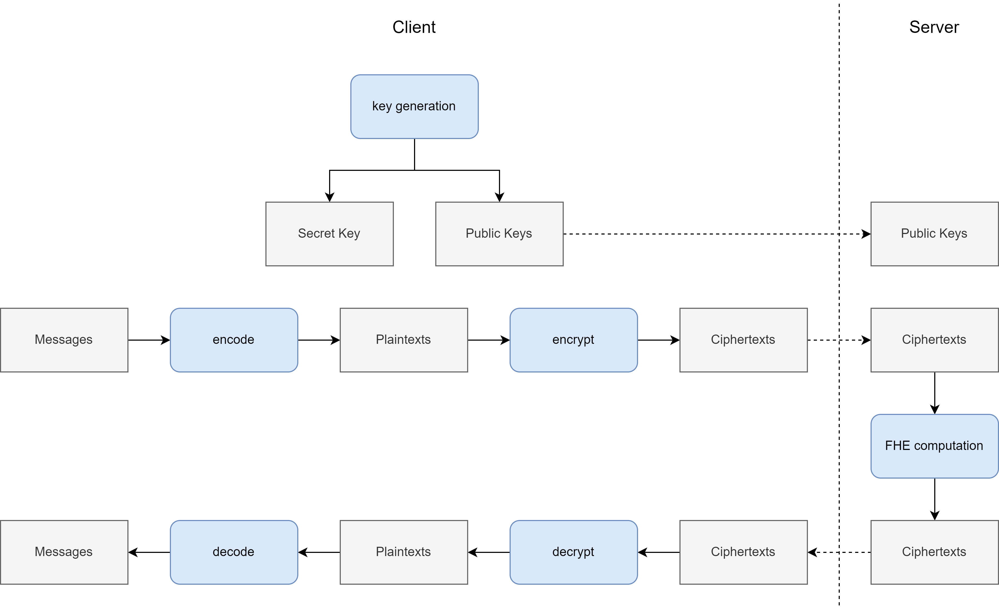

[TOC]

# 平台概述

"格物"全同态加密开发平台提供了一个完整的端到端环境，用于构建和部署基于全同态加密 (FHE) 的解决方案。下图展示了标准的两方 FHE 协议流程。



协议的主要瓶颈在于服务器端的 FHE 计算，这需要大量的计算开销和中间数据存储空间。为了应对这些性能挑战，"格物"集成了一套编译时优化器和一套运行时动态调度器。类似于现代 MLIR 编译框架，这些优化被分层为多个层级（或称为 pass），以系统性地提升执行效率。

在表示层的最高层级，FHE 任务被表达为有向无环图 (DAG)，在 "格物"中称为密文计算流程图 (Encrypted pRocess Graph, ERG)。ERG 由数据节点和计算节点组成：数据节点封装单个 FHE 密文、明文或特定公钥，而计算节点表示数据节点之间的运算，如密文-明文加法、密文-密文乘法、密文旋转或密文自举。"格物"前端提供 Python 接口，使开发者能够以高级语言接口构建这些 ERG。

在执行层，平台设计支持异构加速，允许 FHE 任务由 CPU、GPU 或专用硬件加速器处理。由于这些不同的处理器架构需要专门的指令集和并行化策略，"格物"承担了硬件抽象的关键角色。它自动将高层 ERG 降级为针对用户指定处理器的特定约束和能力而优化和并行化的机器指令。

## 回顾：FHE 数据类型和运算符（BFV 和 CKKS）

全同态加密 (FHE) 方案，特别是 BFV（Brakerski-Fan-Vercauteren）和 CKKS（Cheon-Kim-Kim-Song）算法，建立在分圆环 $R = \mathbb{Z}[x]/(x^N + 1)$ 上的环学习与误差 (RLWE) 问题之上。以下所有 FHE 对象都由 $R$ 上的多项式构造，或由 $R$ 对整数取模后的剩余环上的多项式构造。这使得方案可以直接在加密数据上执行数学运算。

### 参数和密钥管理

FHE 方案的安全性和容量由一组全局参数定义。**环维度 ($N$)** 是 2 的幂次，决定了多项式中的系数数量，进而决定了可用于 SIMD（单指令多数据）处理的"槽位"数量。**密文模数 ($Q$)** 定义了密文多项式中系数的范围。在 BFV 中，**明文模数 ($t$)** 定义了明文多项式中系数的范围，而 CKKS 使用**缩放因子 ($\Delta$)** 来实现定点精度。

密码学生命周期始于**密钥生成**，即创建会话所需密钥的过程：

- **私钥 ($sk$)：** 一个系数较小的私有多项式 $s$，用于解密。
- **公钥 ($pk$)：** 一对 $(a, b)$，其中 $b = -(as + e) \pmod Q$，用于加密。
- **计算密钥 ($evk$)：** 专用密钥，如**重线性化密钥**和 **Galois 密钥**，允许服务器在不访问私钥的情况下执行乘法和旋转等复杂运算。

### 密码学流程

数据经过多次转换以实现同态处理：

1. **编码 (Encode)：** 将原始**消息 ($m$)**（数字向量）转换为**明文 ($pt$)**（环 $R$ 中的多项式）的过程。这将用户数据映射到加密所需的代数结构中。
2. **加密 (Encrypt)：** 使用公钥将明文转换为**密文 ($ct$)** 的过程。密文通常由一对多项式 $(c_0, c_1)$ 组成，它们将底层消息隐藏在一层受控噪声之后。
3. **解密 (Decrypt)：** 使用私钥从密文中提取明文多项式的过程。
4. **解码 (Decode)：** 将明文多项式转换回原始消息格式（数字向量）的最后一步。

在实现中，明文和密文以**剩余数系统 (RNS)** 格式存储。RNS 将大系数表示为对一系列素数 $q_1, q_2, \dots, q_k$ 取模的较小余数集合，使得高精度算术可以使用标准 64 位机器字执行。RNS 结构自然引出了**乘法层级**的概念。密文的层级表示其 RNS 基中剩余素数的数量。

### 支持的计算操作

- **加法和减法：** 支持 **密文-密文** 和 **密文-明文** 计算的逐点运算。

- **乘法：** 支持 **密文-密文** 和 **密文-明文** 乘法的逐点运算。在密文-密文情况下，这会产生一个扩展的"大小为3"的密文 $(c_0, c_1, c_2)$。

- **重线性化 (Relinearization)：** 将大小为3的密文转换回标准的大小为2的形式 $(c_0, c_1)$。

- **重缩放 (Rescaling, CKKS)：** 将消息除以缩放因子并丢弃一个 RNS 素数以管理数值大小。

- **模数切换 (Modulo Switching, BFV)：** 将密文多项式缩小到较小的模数以降低噪声。

- **降层级 (Drop Level, CKKS)：** 通过从 RNS 基中移除一个或多个素数来降低乘法层级。

- **旋转 (Rotation)：** 使用 Galois 密钥在 SIMD 槽位间循环移动消息值。

- **自举 (Bootstrapping, CKKS)：** 同态评估解密电路以刷新密文，重置其噪声并增加其乘法层级。

明文可以参与编码、解码、加密、解密、乘法和加法/减法等运算。关于计算成本，这些运算对明文格式有不同的偏好。为了高效执行这些运算，引入了3种明文格式变体。它们的属性如下所示。

| 明文数据格式 | 支持的操作 | NTT 形式 | Montgomery 形式 | RNS 分量数 | 密文与明文乘法计算开销 |
| --------------------- | -------------------------------------------- | ----------- | -------------------- | ------------------------ | ------------------------------------------------------------ |
| `BfvPlaintext`        | 加密、解密、加法/减法、乘法 | 否          | 否                   | L+1                      | 大                                                         |
| `BfvPlaintextMul`     | 乘法                               | 是         | 是                  | L+1                      | 小                                                        |
| `BfvPlaintextRingt`   | 乘法、加法/减法         | 否          | 否                   | 1                        | 中                                                       |
| `CkksPlaintext`       | 加密、解密、加法/减法、乘法 | 是         | 否                   | L+1                      | 中                                                     |
| `CkksPlaintextMul`    | 乘法                               | 是         | 是                  | L+1                      | 小                                                        |
| `CkksPlaintextRingt`  | 乘法、加法/减法         | 否          | 否                   | 1                        | 大                                                       |

## 定义ERG

ERG 作为 FHE 任务的结构蓝图，被建模为有向无环图 (DAG)。在 "格物"中，ERG 由数据节点和计算节点组成。数据节点表示单个密文、明文、重线性化密钥、Galois 密钥等。计算节点表示数据节点之间的运算，如密文-明文加法、密文-密文乘法、密文旋转或密文自举。这些节点是"抽象"实体——它们定义计算逻辑，在执行时刻之前不与特定的物理数据或内存绑定。

"格物"Python 前端提供高级接口来构建这些 ERG，通过指定 FHE 参数、定义输入节点和链接计算操作。作为运行示例，考虑一个 7 阶多项式求值：$y=\sum_{i=0}^7 a_i x^i$，其中 $x$ 是加密变量，$a_i$ 是明文系数。

要初始化任务，首先建立 FHE 参数，使用硬件优化的默认值或自定义配置：

```python
param = Param.create_bfv_default_param(n=16384)
set_fhe_param(param)
```

接下来，通过指定类型和初始属性（如乘法层级）来定义输入数据节点：

```python
x = BfvCiphertextNode(level=4)
a0 = BfvPlaintextNode(level=1)
a = [BfvPlaintextMulNode(level=1) for i in range(1, 8)]
```

然后通过链接节点来构建计算逻辑。注意，您不需要手动定义计算密钥；前端会自动分析图并将所需的密钥节点插入到最终的 ERG 中：

```python
x1_lv4 = x
x2_lv3 = rescale(mult_relin(x1_lv4, x1_lv4))
x1_lv3 = rescale(x1_lv4)
x3_lv2 = rescale(mult_relin(x1_lv3, x2_lv3))
x4_lv2 = rescale(mult_relin(x2_lv3, x2_lv3))
x2_lv2 = rescale(x2_lv3)
x5_lv1 = rescale(mult_relin(x2_lv2, x3_lv2))
x6_lv1 = rescale(mult_relin(x3_lv2, x3_lv2))
x7_lv1 = rescale(mult_relin(x3_lv2, x4_lv2))
x2_lv1 = rescale(x2_lv2)
x3_lv1 = rescale(x3_lv2)
x4_lv1 = rescale(x4_lv2)
x1_lv2 = rescale(x1_lv3)
x1_lv1 = rescale(x1_lv2)
x_powers = [x1_lv1, x2_lv1, x3_lv1, x4_lv1, x5_lv1, x6_lv1, x7_lv1]
y = a0
for i in range(7):
    y = add(y, mult(x_powers[i], a[i]))
```

最后，通过将节点分组为 `Argument` 对象并将图导出为 JSON 文件供运行时使用，最终完成 ERG：

```python
process_custom_task(
    input_args=[Argument('x', x), Argument('a0', a0), Argument('a', a)],
    output_args=[Argument('y', y)],
    output_instruction_path='examples/bfv_poly_7',
)
```

------

## 运行时 SDK

运行时 SDK 将抽象的 ERG 转换为具体的执行环境。虽然它提供标准的 FHE 工具——如密钥生成、编码和加密——但其在 "格物"中的主要作用是管理 ERG 在各种硬件后端上的高性能执行。

使用多项式求值示例，C++ 应用逻辑从标准 FHE 流程开始：建立上下文、编码消息和加密输入。在此阶段，您还需要为输出密文创建占位符：

```c++
uint64_t n = 16384;
uint64_t t = 0x1b4001;
BfvParameter param = BfvParameter::create_parameter(n, t);
BfvContext context = BfvContext::create_random_context(param);

vector<uint64_t> x_mg({1, 2, 3, 4});
vector<uint64_t> a0_mg({1, 1, 1, 1});
vector<vector<uint64_t>> a_mg;
for(int i = 0; i < 7; i++) {
    a_mg.push_back({i+2, i+2, i+2, i+2});
}
BfvPlaintext x_pt = context.encode(x_mg, 4);
BfvPlaintext a0_pt = context.encode(a0_mg, 1);
vector<BfvPlaintextMul> a_pt_mul;
for(int i = 0; i < 7; i++) {
    a_pt_mul.push_back(context.encode_mul(a_mg[i], 1));
}
BfvCiphertext x_ct = context.encrypt_asymmetric(x_pt);
BfvCiphertext y_ct = context.new_ciphertext(1);
```

要执行任务，运行时变量被映射到 ERG 的命名参数。标量参数 `x`、`a0`、`y` 映射到单个密文或明文对象，而一维向量参数 `a` 映射到 `vector<BfvPlaintextMul>` 对象。然后 SDK 处理该图，利用指定的硬件后端（在本例中为 CPU）来处理实际的 FHE 计算：

```c++
FheTaskCpu task("examples/bfv_poly_7");
vector<CxxVectorArgument> cxx_args = {
    {"x", &x_ct},
    {"a0", &a0_pt},
    {"a", &a_pt_mul},
    {"y", &y_ct},
};
task.run(&context, cxx_args);
```

一旦 `task.run` 完成，输出占位符 (`y_ct`) 就会填充结果。流程以解密和解码结束，以获取最终消息：

```c++
BfvPlaintext y_pt = context.decrypt(y_ct);
vector<uint64_t> y_mg = context.decode(y_pt);
printf("y_mg = [%lu, %lu, %lu, %lu, ...]\n", y_mg[0], y_mg[1], y_mg[2], y_mg[3]);
```


